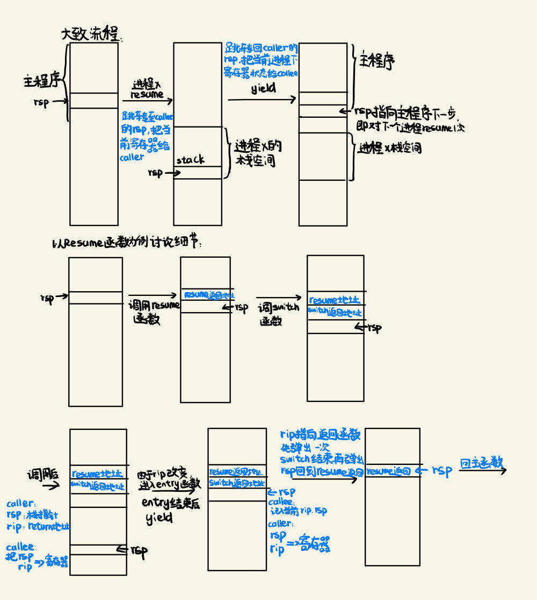
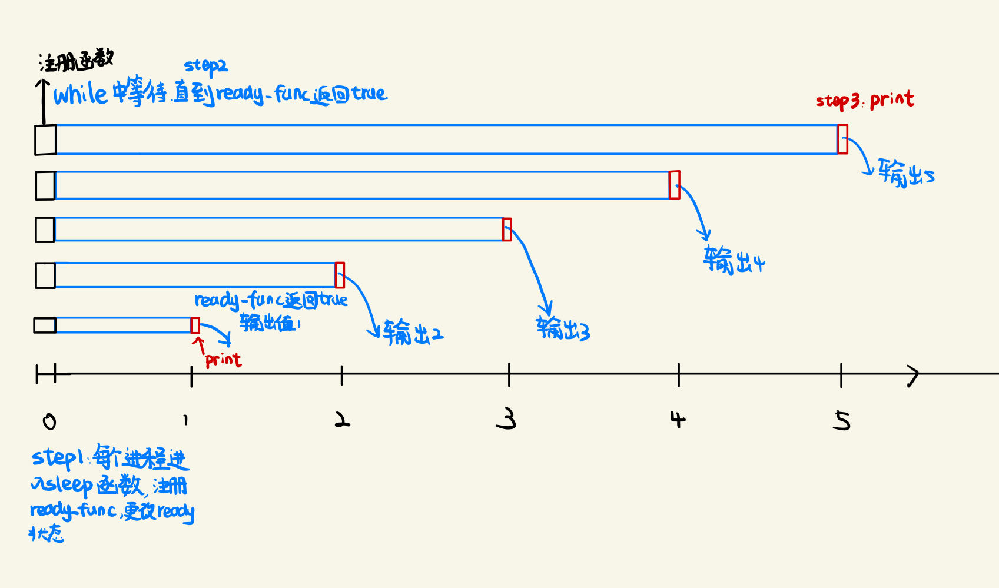
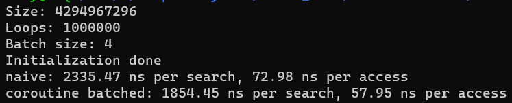
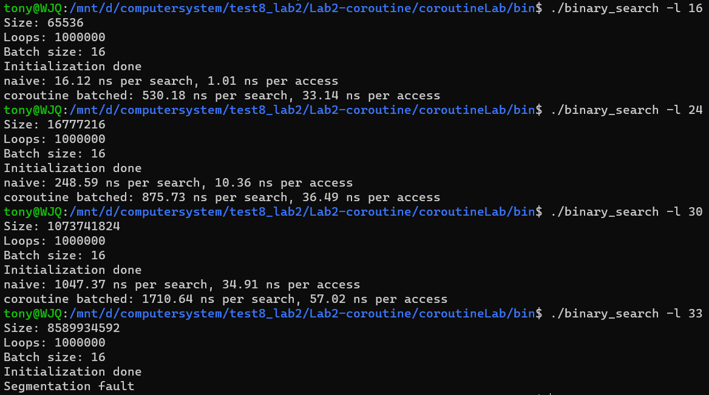

# 吴佳启 CoroutineLab解题报告 计26 2022010869

## TASK 1

### 基础任务

Task1需要完成的基本任务如下：serial_execute_all函数的调用，调用过程中的resume，coroutine_switch与yield三个函数，接下来进行逐一分析。

#### serial_execute_all

这个函数中，他希望的是将第一个进程往前执行一步，然后切换给第二个进程继续往前执行，以此类推，然后每个进程会一直执行，一直到一个进程结束后，这个进程才不再往前，所有进程都结束运行后这个函数结束。我们可以用如下函数来完成。

```c++
    while(true){
      bool finished = true;
      for(int i = 0; i < coroutines.size(); i++){
        g_pool->context_id = i;
        if(!coroutines[i]->finished){
          coroutines[i]->resume();
          finished = false;
        }
      }
      if(finished){
        break;
      }
    }
```

#### coroutine_switch

从字面上理解，这个函数负责进程的切换，具体来说，这个函数接受两个指针，他们指向了不同的记录所有寄存器的指针，第一个是用来保存的——即我们把当前系统的被调用者保存的寄存器赋值给他，第二个是用来赋值的-我们把这些值赋值给系统的寄存器，这里注意到rsp指针的变化，于是可以实现两个进程的切换。

```assembly
    movq %rsp, 64(%rdi)
    movq %rbx, 72(%rdi)
    movq %rbp, 80(%rdi)
    movq %r12, 88(%rdi)
    movq %r13, 96(%rdi)
    movq %r14, 104(%rdi)
    movq %r15, 112(%rdi)
    leaq .coroutine_ret(%rip), %rax
    movq %rax, 120(%rdi)
    # 保存 callee-saved 寄存器到 %rdi 指向的上下文
    # 保存的上下文中 rip 指向 ret 指令的地址（.coroutine_ret）
    movq 64(%rsi), %rsp
    movq 72(%rsi), %rbx
    movq 80(%rsi), %rbp
    movq 88(%rsi), %r12
    movq 96(%rsi), %r13
    movq 104(%rsi), %r14
    movq 112(%rsi), %r15
    # 从 %rsi 指向的上下文恢复 callee-saved 寄存器
    jmpq *120(%rsi)
```

#### resume

在探究resume之前，我们先讨论一下一个进程的两个重要指针：caller_register和callee_register，这两个指针分别指向了两个进程的寄存器，caller_register指向了被调用者，callee_register指向了调用者，具体来说，callee_register指向了当前进程的寄存器，而caller指的是主函数，即调用这个函数的函数的所有寄存器的状态。
resume的意思从字面上不难理解，将一个函数往前进行一步，这里我们通过调用coroutine_switch来完成，具体来说，我们需要先存储当前的状态，根据上面对caller和callee的分析，我们要把当前的寄存器状态存入到caller里，然后把callee存入目前的寄存器，那么现在系统的寄存器就和这个进程的一致了，注意到这里的返回值：是当前进程的rip或者是相对寻址的return，即系统会获取到callee的rip然后跳转，第一次会跳转到这个进程的coroutine_main函数，后来就回到上一次执行的位置了，具体在栈分析中会进行解释。

#### yield

这个函数负责进程的转移，我们还是调用coroutine_switch来完成，这里我们只需要把当前的寄存器状态存入到callee里，然后把caller存入当前的寄存器，具体来说，我们用callee记住了当前系统处于的状态，然后把caller——即调用者主函数的状态给到现在的寄存器，这样系统就会切换回主函数，然后运行下一个协程，同时当前协程的callee存入了当前的状态，再一次切入后可以准确到达处在的位置。

### 附加任务

#### 绘制出在协程切换时，栈的变化过程

<div style="text-align: center;">
    
</div>
这里主要是讨论细节部分，我们以resume函数为例，先把两个返回地址压入栈中，然后由resume函数先调用一次switch，接下来进入这个协程的entry函数，结束后通过yield再次调用switch，注意到这里的switch，由于rip这个时候是一个return函数，我们可以弹出一个地址，然后回到resume函数后，由于这个函数刚好执行结束，我们再弹出一个地址，最终rsp回到了之前保存的调用resume前应该返回的地址，从而可以准确地返回。

#### 结合源代码，解释协程是如何开始执行

首先我们来看一看每个进程的起始初始化函数，这里我们首先获得了stack最底的地址，然后通过位运算处理了16字节的偏移量，然后初始化这个进程的callee registers，存入rsp，把rip和r12作为函数的进入地址，r13记录自己的地址，完成进程的初始化。

```c++
  basic_context(uint64_t stack_size)
      : finished(false), ready(true), stack_size(stack_size) {
    stack = new uint64_t[stack_size];

    // TODO: Task 1
    // 在实验报告中分析以下代码
    uint64_t rsp = (uint64_t)&stack[stack_size - 1];
    rsp = rsp - (rsp & 0xF);//处理16字节的偏移量

    void coroutine_main(struct basic_context * context);

    callee_registers[(int)Registers::RSP] = rsp;
    // 协程入口是 coroutine_entry
    callee_registers[(int)Registers::RIP] = (uint64_t)coroutine_entry;
    // 设置 r12 寄存器为 coroutine_main 的地址
    callee_registers[(int)Registers::R12] = (uint64_t)coroutine_main;
    // 设置 r13 寄存器，用于 coroutine_main 的参数
    callee_registers[(int)Registers::R13] = (uint64_t)this;
  }
```

初始化后，我们调用了serial_execute_all函数，这里我们采用了顺序遍历的方法，判断每个程序是否结束进行，若未结束进行，我们会调用resume函数，这个进程往下进一步，然后由前面对coroutine_switch函数的分析可知，这里会跳转到这个进程的rip，即coroutin_entry函数.

这里我们跳转到了r12存储的地址，即跳转到coroutine_main函数，在这里我们会进行这个进程的run，这里会调用CALL函数，我们来仔细分析这个调用过程。

首先看这个CALL，我们会通过不同常数实现调用多次CALLER_IMPL函数，然后进入CALLER_IMPL，这里我们会判断x和args的size是否一样，如果一样，那么就调用func，这里func的参数是由EXPAND_CALL通过递归的方式展开获得的，然后连接相应参数后调用存储的这个func。

## TASK2

### 基础任务

#### sleep函数

```c++
    auto context = g_pool->coroutines[g_pool->context_id];
    // 从 g_pool 中获取当前协程状态
    context->ready = false;
    auto start_time = get_time();
    auto end_time = start_time + std::chrono::milliseconds(ms);
    auto ready_func = [start_time, end_time]() {
      auto current_time = get_time();
      if (current_time >= end_time) {
        return true;
      }
      return false; 
    };
    // 注册 ready_func
    context->ready_func = ready_func;
    // 获取当前时间，更新 ready_func
    // ready_func：检查当前时间，如果已经超时，则返回 true
    coroutine_switch(context->callee_registers,context->caller_registers);
```

在这个函数里我们首先把这个进程的ready状态设置为false，然后为他注册一个ready_func函数，这个函数的作用是检测当前的时间是否超出了运行时间，然后我们切换上下文回到主进程，在主进程里这个serial_execute_all函数就发生了变化，我们要求一个进程如果执行，第一种情况是它处于ready状态并且尚未停止，我们继续进行就好，第二种是这个进程不处于ready状态，但是他的ready_func返回了true，这个意味着他的等待时间已经结束了，我们继续这个进程，再次调用resume函数就好。


于是在运行程序中，我们给每个进程注册了不同的等待时间和一个输出函数，然后等待时间短的进程的ready_func可以更早返回true，然后再次resume进入进程的下一个函数——即输出函数，于是实现了通过睡眠的方法进行排序。

### 附加任务

#### 绘制出 `sleep_sort` 中不同协程的运行情况

<div style="text-align: center;">
    
</div>

如上图所示，简而言之，就是先给每个协程注册一个ready函数，等待sleep结束后再调用print函数输出答案。

#### 高效的协程库实现方法

开一个全局的队列，每次只对队列里的进程进行resume操作，如果一个进程的ready变化为true，则把这个进程加入队列，反之则从队列中踢出，这样避免了每次轮询，但同时在进程内部我们需要时刻更新他的ready属性判断什么时候加入队列，什么时候退出。

## TASK3
### 代码分析
#### naive方法

全局中我们生成n个数据把他存储在data里，这里是按照从小到大顺序存储的，方便后续的二分查找，然后我们随机生成m个数据，对每个数据进行一次二分查找，在lookup函数中返回data中存储的那个数据，这样模拟一次数据在cpu中的查找，最终将返回的答案存储在res里。

#### coroutine_batched

初始化的方法类似，与之不同的是，这里我们使用协程的方法来执行，具体说，我们把所有要查找的任务根据batch大小分成若个份，对每一份中的数据，直接给每一个数据注册一个lookup_coroutine的函数，然后对当前的进程池调用一次协程执行的函数，与之前的lookup不同的是，这里对每个协程而言，在二分查找时会先调用__builtin_prefetch，这里把需要获得的元素进行预取，放置在高速缓存区，然后切换协程，这样做到在等待数据加载的同时，允许其他协程进行工作，以提高程序的并发性。

#### 添加的代码
这里我们预取里面的中间元素，把这个元素取出来，方便下一次访问与后续优化。

### 额外任务：性能的提升效果
1. 当batch=16时，性能提升效果较差，可能是因为协程的切换耗时大于了预取带来的便利，于是我把batch调小，batch=8或2时，性能均有提升，但不够明显当batch=4时，性能提升效果明显，应该是这样协程切换的时间得到了减少，最终性能提升大概百分之十六。
<div style="text-align: center;">
    
</div>

2. 通过更改log2_bytes的大小，这里我发现size越大优化后的方法优化力度越强，从16开始，log2_bytes越大，二者越接近。虽然在batch等于16时优化后的方法效率更低。
<div style="text-align: center;">
    
</div>

3. m的大小：查询次数，正比关系，对单次查询无太大影响。
4. 优化方法：由于__builtin_prefetch一次是访问多个内存，我们可以在size足够小的时候不再调用。同时由于yield开销大，我们可以减少yield的使用，一次调用多次__builtin_prefetch。这两个方法均提升了程序的性能。
## 交流
就解题报告的形式，我和何泽海同学进行了讨论。
## 总结和感想
本次任务加深了我对协程的理解，之前我的理解局限于一些寄存器的保存以及切换协程的寄存器状态，切换后由于寄存器的改变完成了协程的变化。然而在本次任务中我提高了我对协程的理解，协程的切换不止是寄存器的变化，还有栈上一些属性的变化，这里面重要的是rip和rsp寄存器，分别表示下一条指令与栈顶，二者结合，同时在操作的时候每个协程维护一个寄存器状态，不在栈上存储，更有利于实现。  
除了对协程的实现理解加深以外，我还学到了预取知识——通过预取加快程序的运行效率，尤其要注意到的是协程的切换也是一个很浪费时间的过程，因此理想与实际会存在一定差距，只有通过一些常数系数的优化，才能达到最终的优化效果。
希望以后得实验中有类似课内知识结合的方式，提高我实现知识的能力。
